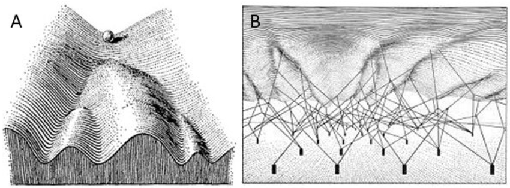

### VLMをそのまま使う流れ

最近，自動運転でもロボットマニピュレーションでも，「VLAよりVLMをそのまま使った方が良い」という，少し面白みのない流れが来ている．
Action HeadやDiscrete Special Tokenすら無くし，VLMに直接制御コマンドをテキストとして出力させる方が性能が高くなるという報告もある（[VLM2VLA](https://arxiv.org/abs/2509.22195), [VLA-0](https://arxiv.org/abs/2510.13054v1)）．

VLAアーキテクチャ自体に致命的な欠陥があるというよりは，学習過程でVLMが破滅的忘却（catastrophic forgetting）を起こしてしまう事が問題だろう．
ただし，それがアーキテクチャ由来かと問われれば，確かにそうかもしれない．

### 破滅的忘却を防ぐ2つの方針
よく破滅的忘却を防ぐためにはLoRAを使えば良いと言われるが，LoRA適用後のモデルの出力分布が局所最適化していたら意味がない．
そこで，この問題を避けるために，現状大きく2つの方針が存在すると認識している．

**1. テキストとして行動を表現する方法**

[VLM2VLA](https://arxiv.org/abs/2509.22195)や[VLA-0](https://arxiv.org/abs/2510.13054v1)のように，数値的な行動表現ではなくテキストとしてActionを出力させる．
これにより事前学習データとのギャップが縮まり，VLMの知識保持と汎化性能向上が期待できる．

**2. テキストと行動の併用学習**

[EO-1](https://arxiv.org/abs/2508.21112)，[SimLingo](https://arxiv.org/abs/2503.09594)，[Pi0.5](https://arxiv.org/abs/2504.16054)のように，事後学習でも行動出力とテキスト出力を同時に扱う．
ある意味で素直な解決方法と言えるが，この方法だとデータの質に性能が大きく左右されてしまうのは言うまでもない．

### 私の考える第3のアプローチ

たとえば次のような二段階学習を行えば，VLMの事前学習知識を保存できるのではないかと考えている．

**1.** LoRAを用いて，テキストとして行動を出力するようにVLMを微調整する．
**2.** 中規模のTransformerをAction Expertとして導入し，VLMを凍結した状態でVLMの潜在表現や画像特徴量をConditioningしながら，DiffusionまたはFlow Matching損失でAction Expertが連続行動を出力するよう学習する．

現在想定している，この構成のメリットは以下の通りである．

- VLMの汎化性能を維持できる
- Diffusionによってマルチモーダルな連続行動生成が可能
- Action Expertは独立して学習するため，触覚・聴覚などの他モーダルの追加が容易
- 強化学習との統合もスムーズ（[DPPO](https://arxiv.org/abs/2409.00588)や[ReinFlow](https://arxiv.org/abs/2505.22094)を参照）

### Waddington地形としてのVLA

最後に少し妄想的な話をしてみる．
そもそも，最近のVLAの行動生成によく使われているDiffusionやFlow MatchingはEnergy-Based Model (EBM) をベースとしている．
ここで例として，VLAのAction ExpertをEBMで構成すれば，Action Expertはエネルギー地形として解釈することができ，VLA全体をWaddington地形のアナロジーで理解できるかもしれない．

つまり，VLM出力などのConditioning要素がエネルギー地形を変形させ，その上を“球”が転がるようにして行動が決定される．
このアナロジーで，生命の細胞分化の正確性やロバスト性を，VLAの行動決定メカニズムに導入できるかもしれない．

### 参考文献

https://mbreuss.github.io/blog_post_iclr_26_vla.html